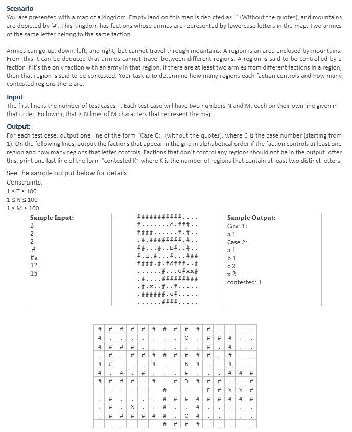

# KINGDOM PROBLEM

### Scenario
You are presented with a map of a kingdom. Empty land on this map is depicted as ‘.’ (Without the quotes), and mountains are depicted by ‘#’. This kingdom has factions whose armies are represented by lowercase letters in the map. Two armies of the same letter belong to the same faction.<br/><br/>
Armies can go up, down, left, and right, but cannot travel through mountains. A region is an area enclosed by mountains. From this it can be deduced that armies cannot travel between different regions. A region is said to be controlled by a faction if it’s the only faction with an army in that region. If there are at least two armies from different factions in a region, then that region is said to be contested. Your task is to determine how many regions each faction controls and how many contested regions there are.<br/>
<br/>
**Input:**<br/>
The first line is the number of test cases T. Each test case will have two numbers N and M, each on their own line given in that order. Following that is N lines of M characters that represent the map.<br/>
<br/>
**Output:**<br/>
For each test case, output one line of the form “Case C:” (without the quotes), where C is the case number (starting from 1). On the following lines, output the factions that appear in the grid in alphabetical order if the faction controls at least one region and how many regions that letter controls. Factions that don’t control any regions should not be in the output. After this, print one last line of the form “contested K” where K is the number of regions that contain at least two distinct letters.<br/>
See the sample output below for details.<br/>
<br/>
Constraints:<br/>
1 ≤ T ≤ 100<br/>
1 ≤ N ≤ 100<br/>
1 ≤ M ≤ 100<br/>
<br/>
**Note:**<br/>
A text file named ```map.txt``` is included that contains the map for the second case.<br/>
<br/>
<br/>



